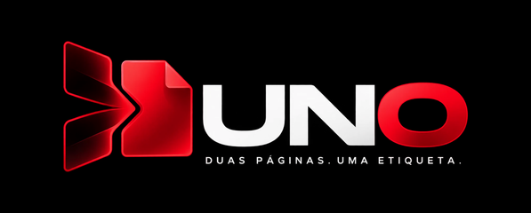
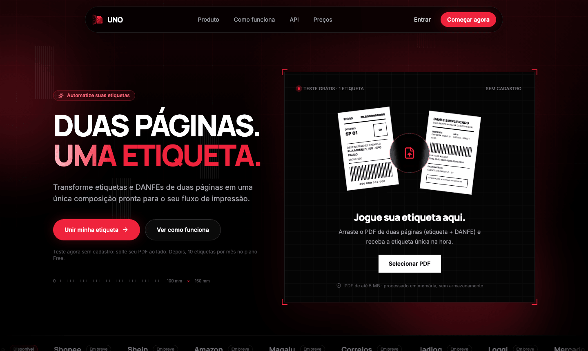
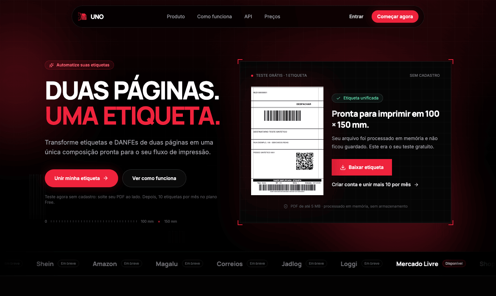

<p align="center">
  
</p>

<p align="center">
  <strong>Duas páginas. Uma etiqueta.</strong><br>
  Une a etiqueta de envio e a DANFE do marketplace em uma única etiqueta 100 × 150 mm pronta para imprimir.
</p>

<p align="center">
  
</p>

## O que é

Quem vende em marketplace recebe, para cada pedido, um PDF de duas páginas: a
etiqueta logística e a DANFE simplificada. Isso significa duas etiquetas
térmicas por pacote. O UNO lê esse PDF e devolve **uma** etiqueta 10 × 15 com:

1. um cabeçalho opcional de separação (quantidade, produto, SKU e variação);
2. a etiqueta logística original, sem os espaços em branco;
3. uma faixa "DANFE SIMPLIFICADA – ETIQUETA" com tipo, NF, série, emissão e o
   código de barras original da chave de acesso.

<p align="center">
  
</p>

O conteúdo vem do próprio PDF: as regiões digitais são incorporadas como vetor
(sem rasterizar), os campos fiscais são lidos do texto do documento e conferidos
contra a chave de acesso, e todos os códigos de barras e QR são decodificados na
saída a 203 e 300 dpi e comparados com os da entrada. Se algo não fecha, a
conversão falha com um motivo claro em vez de gerar uma etiqueta "por tentativa".

## Funcionalidades

- **Conversão individual** pelo painel, com progresso real, comparação antes/depois, download e impressão.
- **Teste sem cadastro** na página inicial: uma etiqueta, processada em memória, sem armazenamento.
- **Lotes** com envio retomável e saída em ZIP.
- **Histórico** pesquisável e reprocessamento.
- **API pública** assíncrona e idempotente (`/api/v1`) para ERPs, com chaves Bearer exibidas uma única vez.
- **Webhooks** assinados (HMAC-SHA-256), com novas tentativas e proteção contra SSRF.
- **Organizações**, membros, convites por e-mail e transferência de propriedade.
- **Assinaturas** via Stripe Checkout e Customer Portal, com cota mensal atômica.
- **Administração**: financeiro, clientes, atividade, chaves de API, conexões e liberação de templates.
- **Retenção**: remoção automática dos arquivos conforme o plano.

## Como funciona a engine

```
PDF original → Analyzer → Template Detector → Content Extractor → Layout Engine → PDF Composer → Validator → PDF final
```

Cada layout de marketplace ou transportadora é uma **definição versionada** em
[`src/engine/templates/`](src/engine/templates): dimensões da página, faixas
úteis, âncoras de detecção, códigos protegidos e, opcionalmente, como resumir a
página fiscal. As seis etapas são genéricas; um novo layout é uma nova definição.
Hoje existe um template: **Mercado Livre 1.0.0**. Um documento desconhecido ou
ambíguo é recusado — não há "melhor esforço".

## Stack

| Camada | Tecnologia |
| --- | --- |
| Aplicação | Next.js 16 (App Router), React 19, TypeScript estrito |
| Interface | Tailwind CSS 4, Radix UI, Motion, Lucide |
| Banco | PostgreSQL + Drizzle ORM |
| Fila e limites | Redis + BullMQ |
| Arquivos | S3 compatível (Cloudflare R2 em produção), sempre privado |
| PDF | pdf-lib, PDF.js, @napi-rs/canvas, ZXing; Tesseract para PDFs escaneados |
| Autenticação | Better Auth |
| Cobrança | Stripe |
| E-mail | Resend (Mailpit em desenvolvimento) |
| Observabilidade | Sentry e PostHog, opcionais e sem conteúdo de documento |
| Testes | Vitest + PGlite, Playwright |

## Rodando localmente

Requer Node.js 24 e pnpm (`corepack enable`). Os serviços locais estão em
[`compose.yaml`](compose.yaml): PostgreSQL, Redis, MinIO e Mailpit.

```bash
pnpm install --frozen-lockfile
cp .env.example .env.local      # defina BETTER_AUTH_SECRET (32+ caracteres) e WEBHOOK_ENCRYPTION_KEY
docker compose up -d
pnpm db:migrate
pnpm dev                        # aplicação
pnpm worker                     # em outro terminal: conversões, lotes, webhooks e retenção
```

Sem Docker, use serviços equivalentes nas mesmas portas; para o armazenamento há
um emulador: `pnpm dev:s3`. Em desenvolvimento, `UNO_ALLOW_DRAFT_TEMPLATES=true`
permite usar o template antes da liberação.

Comandos úteis:

| Comando | O que faz |
| --- | --- |
| `pnpm check` | lint, typecheck, testes e build de produção |
| `pnpm test:e2e` | testes de navegador (Chromium, Firefox, WebKit e mobile) |
| `pnpm admin:local [email]` | cria ou promove um administrador local |
| `pnpm stripe:setup <arquivo .env>` | cria planos, preços e portal na conta Stripe daquele arquivo |
| `pnpm proof:print --width 100 --height 150` | gera um candidato sintético para a prova de impressão |

## API em 30 segundos

```bash
curl "$UNO_API_URL/api/v1/conversions" \
  -H "Authorization: Bearer $UNO_API_KEY" \
  -H "Idempotency-Key: pedido-0001" \
  -F "file=@pedido.pdf;type=application/pdf" \
  -F "productTitle=Nome do produto" -F "quantity=2" -F "sku=SKU-01"
# 202 → consulte GET /api/v1/conversions/{id} ou receba o webhook conversion.completed
```

Referência completa, com exemplos em JavaScript, Node.js e Python, em
[`docs/api-v1.md`](docs/api-v1.md).

## Estrutura

```
src/engine/      pipeline de PDF e definições de template
src/server/      serviços: conversões, lotes, API, webhooks, cobrança, organizações, admin, retenção
src/workers/     processo de fila e manutenção
src/app/         páginas e rotas (site, painel, admin, /api)
specs/           especificação do produto, contratos e decisões de arquitetura
docs/            API, cobrança, segurança, deploy e evidências de validação
tests/           testes unitários, de integração e de navegador (somente dados sintéticos)
```

## Estado do projeto

O sistema roda de ponta a ponta em ambiente local e passa na suíte automatizada,
mas **ainda não foi publicado em produção**. Antes disso:

- nenhum template/tamanho está liberado: a liberação exige o relatório
  automático e a **prova física de impressão** descritos em
  [`docs/printing-validation.md`](docs/printing-validation.md);
- as imagens do [`Dockerfile`](Dockerfile) e o roteiro de
  [`docs/deploy.md`](docs/deploy.md) ainda não foram executados;
- a faixa resumida da DANFE omite protocolo, remetente e destinatário; avaliar
  se isso atende à sua operação fiscal é responsabilidade de quem opera;
- o detalhe do que foi e do que não foi verificado está em
  [`docs/validation.md`](docs/validation.md) e
  [`docs/implementation-checklist.md`](docs/implementation-checklist.md).

Shopee, Shein, Amazon, Magalu, Correios, Jadlog e Loggi aparecem na página
inicial como "em breve": são o roteiro, não templates existentes.

## Privacidade e segurança

Os arquivos ficam em armazenamento privado e saem apenas por links assinados com
validade curta. Bytes de documentos e dados fiscais não entram em logs nem em
telemetria. Chaves de API são guardadas somente como hash; segredos de webhook,
cifrados. Os testes e as capturas deste repositório usam **apenas dados
sintéticos** — nunca versione etiquetas, notas ou credenciais reais. Detalhes em
[`docs/security.md`](docs/security.md).

## Contribuindo

Leia [`AGENTS.md`](AGENTS.md) e a especificação em [`specs/`](specs). Mudanças de
comportamento começam pelo contrato correspondente; rode `pnpm check` antes de
abrir um pull request. Para propor um novo template, inclua a definição, fixtures
sintéticas e os testes da engine.

## Licença

Ainda não há um arquivo de licença neste repositório. Enquanto ele não existir, o
código é público para leitura, mas todos os direitos permanecem com o autor.
